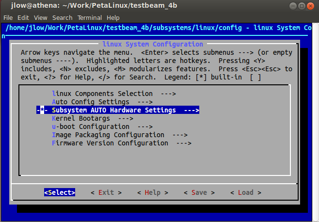
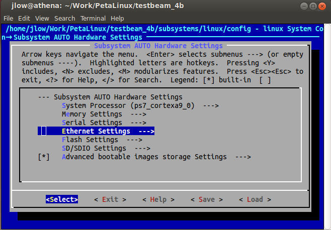
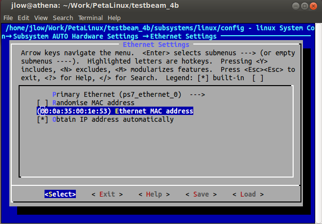
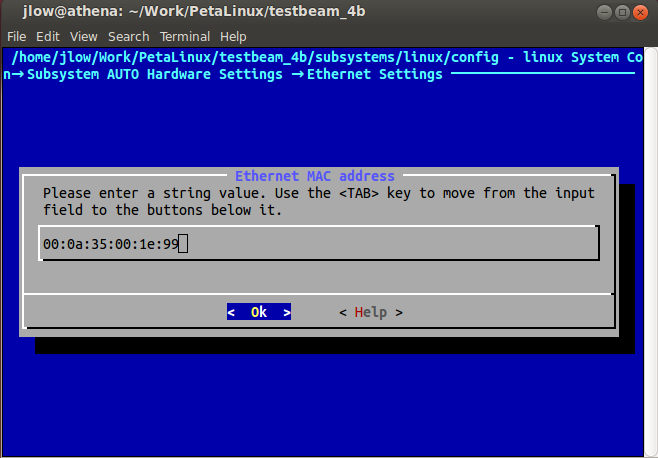
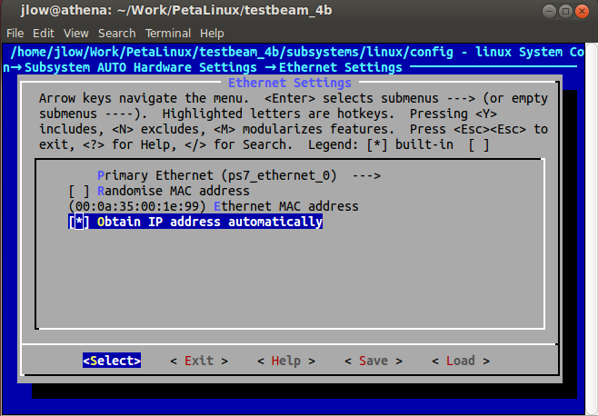
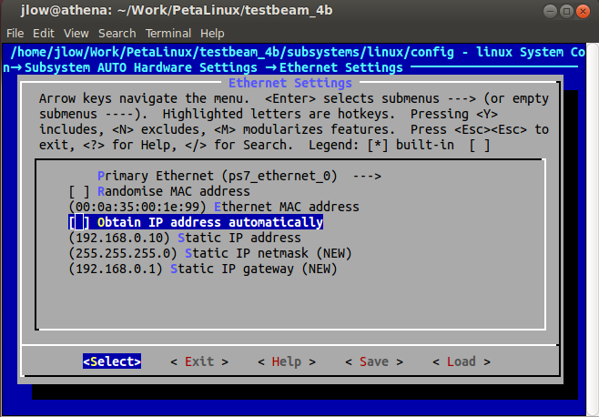
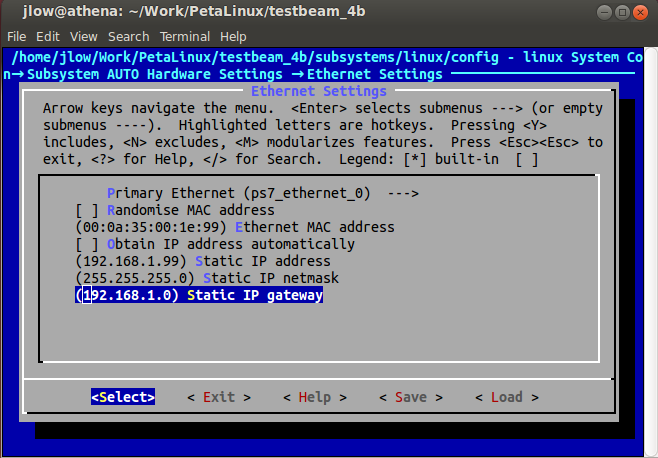

# petalinux-build

## How to make a PetaLinux project

### Preliminaries

- My system:
  - Ubuntu 14.04.3 LTS
  - Vivado 2015.2
  - PetaLinux 2015.2.1

- I am using these directories (please replace them in your build):
  - SDK (with hardware bitstream):  
    `/home/jlow/Work/Vivado/testbeam_4a/testbeam_4a.sdk/`
  - C codes and device tree files:  
    `/home/jlow/Work/test_beam_DAQ_2015/projects/testbeam_4a/software/`
  - PetaLinux build area:  
    `/home/jlow/Work/PetaLinux/testbeam_4a`

### Build

1. Create the project in the build area.
  
  ```
  cd /home/jlow/Work/PetaLinux/
  petalinux-create -t project -n testbeam_4a --template zynq
  cd testbeam_4a
  ```

  - Remember to setup the Petalinux environment first, e.g. `source /opt/PetaLinux/petalinux-v2015.2.1-final/settings.sh`

1. Get hardware description and make changes to the Linux OS.

  ```
  petalinux-config --get-hw-description=/home/jlow/Work/Vivado/testbeam_4a/testbeam_4a.sdk
  ```

  - A Linux config menu is prompted. Select "Subsystem AUTO Hardware Settings".  
  

  - Next, select "Ethernet Settings".  
  

  - Select "(00:0a:35:00:1e:53) Ethernet MAC address".  
  

  - Change MAC address to e.g. "00:0a:35:00:1e:99".  
  

  - Back to the previous menu, deselect "Obtain IP address automatically".  
  

  - Three new configurations appear for static IP address, netmask and gateway. Change IP address to e.g. "192.168.1.99", and change IP gateway to e.g. "192.168.1.0".  
  <br/>
  

  - Exit from the entire menu, save the config when asked. To reconfigure Linux at a later time, call `petalinux-config`. Note that these can be done by manually editing the file `subsystems/linux/config`.  
  - (Optional) Configure kernel and rootfs settings by calling `petalinux-config -c kernel` and `petalinux-config -c rootfs`, respectively. Note that these can be done by manually editing the files `subsystems/linux/configs/kernel/config` and `subsystems/linux/configs/rootfs/config`, respectively.  

1. Create the application (and enable it), then build the Linux OS. This will take a while for the first time.

  ```
  petalinux-create -t apps -n linux_skiroc_sc_test --template c --enable
  cp /home/jlow/Work/test_beam_DAQ_2015/projects/testbeam_4a/software/linux_skiroc_sc_test.c components/apps/linux_skiroc_sc_test/
  cp /home/jlow/Work/test_beam_DAQ_2015/projects/testbeam_4a/software/system-top.dts subsystems/linux/configs/device-tree/
  petalinux-build
  ```

1. Create the boot image in the `images/linux/` subdirectory.

  ```
  cd images/linux/
  petalinux-package --boot --fsbl zynq_fsbl.elf --fpga design_1_wrapper.bit --uboot --force
  cd -
  ```

1. Finally, copy `BOOT.BIN` and `image.ub` from the `images/linux/` subdirectory into the SD card. 

### Run

1. Use the SD card to boot the ZedBoard. When prompted for username and password, enter "root" for both. 
  - Execute the application by running `linux_skiroc_sc_test`.

  - To check MAC and IP addresses, run `ifconfig`. My output is as follows ("HWaddr": MAC address, "inet addr": IP address):

  ```
  root@testbeam_4b:~# ifconfig 
  eth0      Link encap:Ethernet  HWaddr 00:0A:35:00:1E:99  
            inet addr:192.168.1.99  Bcast:192.168.1.255  Mask:255.255.255.0
            UP BROADCAST MULTICAST  MTU:1500  Metric:1
            RX packets:0 errors:0 dropped:0 overruns:0 frame:0
            TX packets:0 errors:0 dropped:0 overruns:0 carrier:0
            collisions:0 txqueuelen:1000 
            RX bytes:0 (0.0 B)  TX bytes:0 (0.0 B)
            Interrupt:144 Base address:0xb000 
  
  lo        Link encap:Local Loopback  
            inet addr:127.0.0.1  Mask:255.0.0.0
            inet6 addr: ::1/128 Scope:Host
            UP LOOPBACK RUNNING  MTU:65536  Metric:1
            RX packets:0 errors:0 dropped:0 overruns:0 frame:0
            TX packets:0 errors:0 dropped:0 overruns:0 carrier:0
            collisions:0 txqueuelen:0 
            RX bytes:0 (0.0 B)  TX bytes:0 (0.0 B)
  ```

