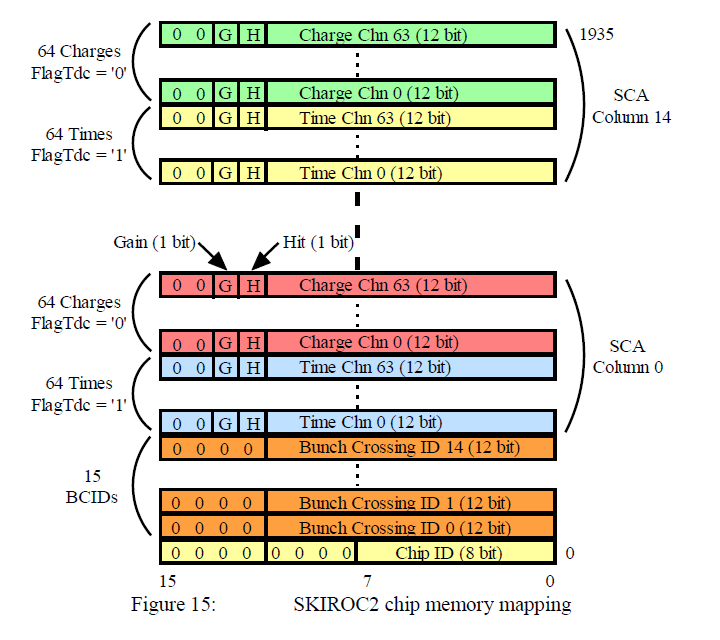
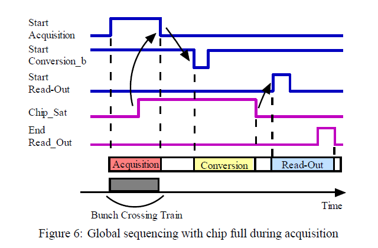
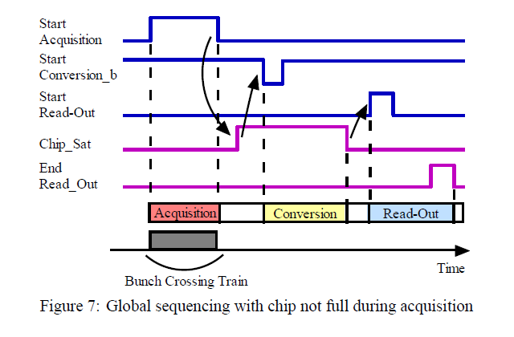

# skiroc2-data-readout

## Introduction

This page documents the software used to access the SKIROC2 data readout.

According to EUDET-Memo-2010-05, SKIROC2 chips can acquire 15 events on 64 channels. The ADC resolution is 12-bits for charge and time, so the maximum number of stored data is 30976 bits. With a readout clock of 5 MHz, total readout duration is 6195.2 &mu;s. Conversion duration is 15 SCA x 2 (HG or LG/time) x 103 &mu;s = 3090 &mu;s.

### Memory mapping

- bits 0-15: Chip ID (8 bit) + NULL (8 bit)
- bits 16-31: Bunch Crossing ID 0 (12 bit) + NULL (4 bit)
- bits 32-47: Bunch Crossing ID 1 (12 bit) + NULL (4 bit)
- ...
- bits 240-255: Bunch Crossing ID 14 (12 bit) + NULL (4 bit)
- bits 256-271: SCA Column 0 Time Channel 0 (12 bit) + Hit (1 bit) + Gain (1 bit) + NULL (2 bit)
- ...
- bits 1264-1279: SCA Column 0 Time Channel 63 (12 bit) + Hit (1 bit) + Gain (1 bit) + NULL (2 bit)
- bits 1280-1295: SCA Column 0 Charge Channel 0 (12 bit) + Hit (1 bit) + Gain (1 bit) + NULL (2 bit)
- ...
- bits 2288-2303: SCA Column 0 Charge Channel 63 (12 bit) + Hit (1 bit) + Gain (1 bit) + NULL (2 bit)
- ...
- bits 28928-28943: SCA Column 14 Time Channel 0 (12 bit) + Hit (1 bit) + Gain (1 bit) + NULL (2 bit)
- ...
- bits 29936-29951: SCA Column 14 Time Channel 63 (12 bit) + Hit (1 bit) + Gain (1 bit) + NULL (2 bit)
- bits 29952-29967: SCA Column 14 Charge Channel 0 (12 bit) + Hit (1 bit) + Gain (1 bit) + NULL (2 bit)
- ...
- bits 30960-30975: SCA Column 14 Charge Channel 63 (12 bit) + Hit (1 bit) + Gain (1 bit) + NULL (2 bit)

### Global sequencing
The global sequencing is made around 3 signals coming from the DAQ: _StartAcquisition_, _StartConversionb_ and _StartReadout_. In response to these 3 signals, the chips answer with 2 signals: _ChipSat_ when one or more chips are full; otherwise it notifies when the conversion could start. The second one is the daisy chain _EndReadout_ which starts the readout of the following chip in the chain. The global sequencing is different whether the chip is full during the acquisition (Figure 6) or not (Figure 7).

